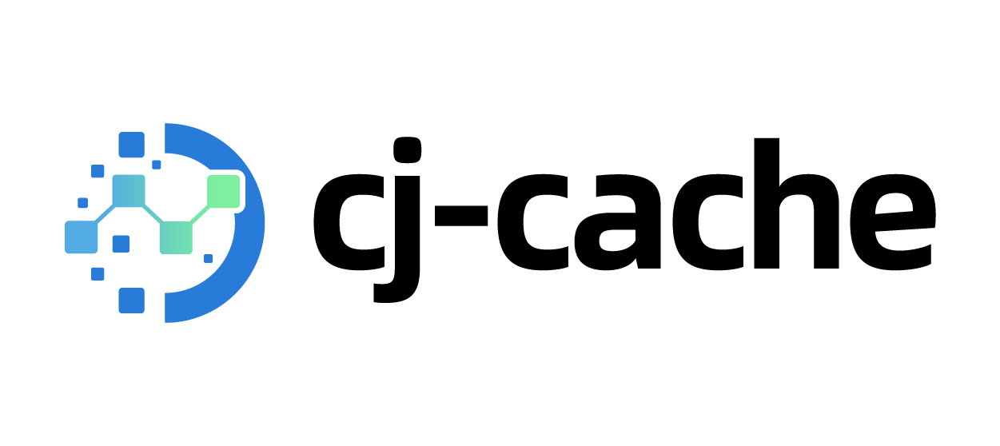

<p align="center">

</p>

<p align="center">


</p>


##  介绍

基于内存的 key value 缓存，适合单机程序。 go-cache 的仓颉实现。

### 特性

- 🚀 基于内存缓存
- 💪 Int 相关类型扩展方法

##  软件架构

### 源码目录

```shell
.
├── README.md
├── doc
│   ├── assets   
│   ├── cjcov   
│   ├── design.md  
│   ├── proposal.md
│   └── xxx_lib.md 
├── src
│   ├── cache.cj
│   └── number.cj
└── test   
    ├── HLT
    ├── LLT
    └── UT
```

- `doc` 是库的设计文档、提案、库的使用文档、LLT 用例覆盖
- `src` 是库源码目录
- `test` 是存放测试用例，包括 HLT 用例、LLT 用例和 UT 用例

### 接口说明

主要是核心类和成员函数说明

#### class Cache<T>

```
创建缓存实例，items: 设置初始的缓存项目
public init(defaultExpiration: Duration, cleanupInterval: Duration, items: HashMap<String, Item<T>>)

创建缓存实例，defaultExpiration 为过期时间，cleanupInterval 为自动清除缓存的时间，需要大于 0 才会执行自动清理
public init(defaultExpiration: Duration, cleanupInterval: Duration)

设置值，不检查是否存在
public func Set(k: String, v: T, d!: Duration = NoExpiration)

使用默认过期时间将项目添加到缓存，替换任何现有项目
public func SetDefault(k: String,v: T)

添加一个值，会检查值是否存在，存在时则返回错误
public func Add(k: String, v: T, d!: Duration = DefaultExpiration): Result<Unit>

替换缓存的值
public func Replace(k: String, v: T, d!: Duration = DefaultExpiration): Result<Unit>

获取一个值
public func Get(k: String): Option<T>

获取值和过期时间
public func GetWithExpiration(k: String): Option<T * Int64>

删除一个项目
public func Delete(k: String)

删除所有已过期的项目
public func DeleteExpired()

设置回调，在删除 key 时，会调用设置的方法进行通知
public func OnEvicted(fn: (String, T) -> Unit)

获取所有缓存的项目
public func Items(): HashMap<String, Item<T>>

获取缓存项目数量
public func ItemCount(): Int64

清除掉所有缓存的项目
public func Flush()

把缓存写入WriteStream
public func Save (w: WriteStream)

把缓存写入文件
public func SaveFile(filename: String)

从 ReadStream 读取缓存
public func Load(r: ReadStream)

从文件读取缓存
public func Loadfile(filename: String)
```

#### 当 T 为 Int 相关类型时有以下扩展方法

```
Int8 自增
public func IncrementInt8(k: String, n: T):Result<Unit>

Int16 自增
public func IncrementInt16(k: String, n: T): Result<Unit>

Int32 自增
public func IncrementInt32(k:String, n:T):Result<Unit>

Int64 自增
public func Increment(k: String, n: T):Result<Unit>

Int8 自减
public func DecrementInt8(k: String, n: T):Result<Unit>

Int16 自减
public func DecrementInt16(k: String, n: T):Result<Unit>

Int32 自减
public func DecrementInt32(k: String, n: T):Result<Unit>

Int64 自减
public func Decrement(k: String, n: T):Result<Unit>
```

##  编译执行

### 使用

- 下载代码并创建 cpm 项目，cj-cache 和需要使用的项目目录平级(否则自行修改依赖的 path 字段)

```shell
$ cd ~/CodeToCangjie
$ git clone https://gitee.com/HW-PLLab/cj-cache.git
$ mkdir cjcache-demo
$ cd cjcache-demo
$ cpm new test demo

```
- 在 `cjcache-demo/module.json` 添加 `requires`
```json
"requires": {
    "cj_cache": {
		"organization": "ystyle",
		"version":"1.0.0",
		"path": "../cj-cache"
	}
}
```

- 导入包

```cj
from cj_cache import cache.*
```

### 示例

```
from cj_cache import cache.*
from std import time.*

main() {
    let c = Cache<Int64>(Duration.minute(5) , Duration.minute(10))
    c.Set("1", 1)
    let i = c.Get("1")??0
    println("i: ${i}")
}
```

##  参与贡献

主要写参与贡献的人以及个人主页链接

[@ystyle](https://gitee.com/ystyle)
